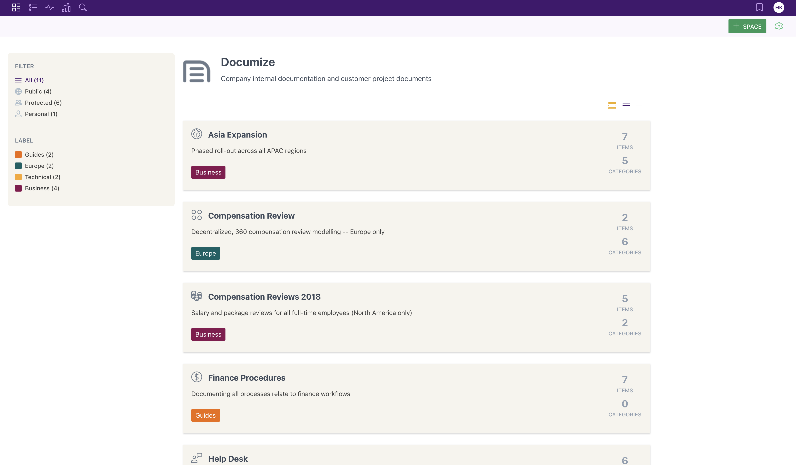

<!--
N.B.: This README was automatically generated by https://github.com/YunoHost/apps/tree/master/tools/README-generator
It shall NOT be edited by hand.
-->

# Documize pour YunoHost

[](https://dash.yunohost.org/appci/app/documize)    
[](https://install-app.yunohost.org/?app=documize)

*[Read this readme in english.](./README.md)*

> *Ce package vous permet d'installer Documize rapidement et simplement sur un serveur YunoHost.
Si vous n'avez pas YunoHost, regardez [ici](https://yunohost.org/#/install) pour savoir comment l'installer et en profiter.*

## Vue d'ensemble

Documize Community is an open source modern, lightweight alternative to Confluence and other similar solutions.

### Features

- Built for technical and non-technical users
- Designed to unify both customer-facing and internal documentation
- Organization through labels, spaces and categories

**Version incluse :** 5.0.1~ynh1

**Démo :** https://demo.example.com

## Captures d'écran



## Documentations et ressources

* Site officiel de l'app : <https://www.documize.com>
* Documentation officielle de l'admin : <https://docs.documize.com>
* Dépôt de code officiel de l'app : <https://github.com/documize/community>
* Documentation YunoHost pour cette app : <https://yunohost.org/app_documize>
* Signaler un bug : <https://github.com/YunoHost-Apps/documize_ynh/issues>

## Informations pour les développeurs

Merci de faire vos pull request sur la [branche testing](https://github.com/YunoHost-Apps/documize_ynh/tree/testing).

Pour essayer la branche testing, procédez comme suit.

``` bash
sudo yunohost app install https://github.com/YunoHost-Apps/documize_ynh/tree/testing --debug
ou
sudo yunohost app upgrade documize -u https://github.com/YunoHost-Apps/documize_ynh/tree/testing --debug
```

**Plus d'infos sur le packaging d'applications :** <https://yunohost.org/packaging_apps>
